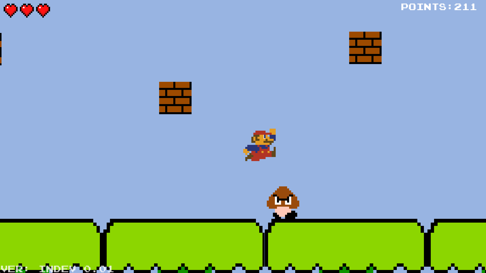

# PlatformingGame

## Q: What is this repo all about?

**A:** This repository contains source code for my mini-project which is a platforming game made with SFML library. 

## Q: How can I play it?

**A:** You should be able to download it from the releases tab (The releases will be uploaded soon). You can play the game on
Windows, MacOS and GNU/Linux.

# DISCLAIMER

None of the assets used in the game belong to me. All of the assets belong to Nintendo. If you feel like supporting Nintendo please consider buying one of their games.
